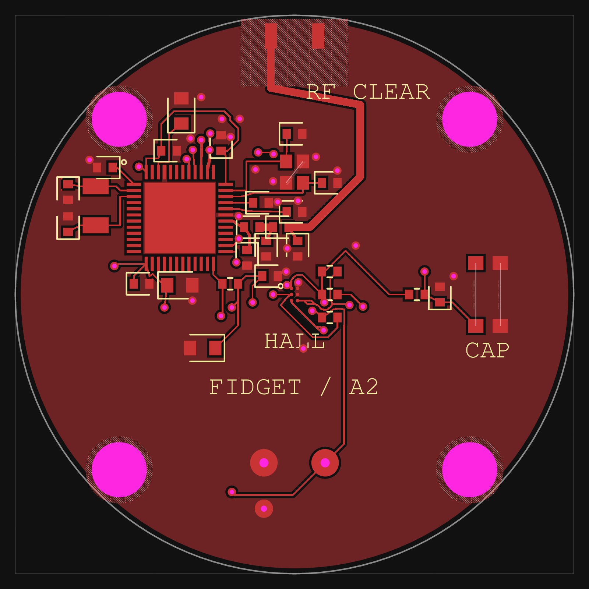

# MagSafe BLE Fidget Counter — PCB Rev A

> **Published prototype: 0.20 mm via drill / 0.45 mm via land.** This release preserves the earlier validated Rev A routing selected for publication. It is separate from the ongoing 0.30 mm via revision; smaller-via fabrication costs and assembly review remain applicable.

The default entrypoint is `published.circuit.json`, the exact validated routed board. `bun run build` renders that saved board without running the autorouter again. The editable design is `index.circuit.tsx`; `bun run build:source` deliberately generates new routing and requires fresh validation. `bun run check:all` checks the source netlist and placement, verifies the saved board hash, runs the full validator, checks Gerber-derived shorts and analyzes all 20 electrical nets.



A 36.5 mm circular, two-layer, 1.0 mm PCB for the existing rotating-cap enclosure. The nRF52810-QFAA reference, its power circuitry, crystals and initial RF matching values come from [seveibar/nrf52810](https://tscircuit.com/seveibar/nrf52810#files), installed as `@tsci/seveibar.nrf52810@0.1.3`. This is a new circular layout; the reference's RF qualification does not carry over.

The central TMAG3001A2 measures the diametric encoder magnet's XY angle. A cap-operated tactile switch supports a two-second count-reset hold in firmware. The CR2032 is replaceable through the two-screw underside hatch. Five underside pogo pads provide SWD access. No LED, charging circuit or tall programming connector is fitted.

## Open and build

```sh
bun install --frozen-lockfile
bun run dev
bun run check:all
```

Use the project's local CLI through `bun run tsci` to keep the tool version consistent with the lockfile. At project initialization, tscircuit 0.0.2748 and CLI 0.1.2253 were verified against the official npm registry. See `bun.lock` for installed dependency versions.

`check:all` runs TypeScript, every TSCI check command, a routed build, the full `@tscircuit/checks` validator, and Gerber-derived shorts on both layers. It analyzes trace lengths for every electrical net and requires all eight crystal signal branches to be at most 10 mm with zero vias. Results and source hashes go to `work/`. It fails on design errors, warnings, actionable placement issues or an asynchronous tool exception. Routing difficulty is an advisory congestion estimate; successful routing and DRC determine the final result.

The board uses an explicit parts engine that returns the authored supplier identifiers. Pin roles and manufacturer choices come from the listed datasheets and BOM, so checks do not replace them with remote supplier suggestions. No design-rule check is disabled.

`index.circuit.tsx` defines placement, nets, four schematic sheets and routing. `parts.tsx` contains the reference MCU footprint, crystals/antenna and manufacturer-specific sensor/switch land patterns. The physical MCU is declared once and split into sheet-local schematic boxes.

## Hardware and firmware handoff

| Signal | nRF52810 GPIO / physical QFAA pin | Peripheral |
|---|---|---|
| SCL | P0.26 / 38 | U2 C2, 10 kΩ pull-up |
| SDA | P0.27 / 39 | U2 C1, 10 kΩ pull-up |
| HALL_INT | P0.28 / 40 | U2 B1, active-low open drain, 10 kΩ pull-up |
| CAP_PRESS | P0.29 / 41 | SW1 closes to GND, 100 kΩ pull-up, 10 nF filter |
| SWDCLK | 25 | TP_SWDCLK |
| SWDIO | 26 | TP_SWDIO |
| nRESET | P0.21 / 24 | TP_RESET, 100 kΩ pull-up |
| LF crystal | P0.00 / 2, P0.01 / 3 | 32.768 kHz |
| HF crystal | XC1 / 34, XC2 / 35 | 32 MHz |

Supply is the CR2032 directly, nominal 3 V. U1 operates from 1.7–3.6 V and U2 from 1.65–3.6 V. Set **DCDCEN = 0**: this retains the reference's LDO-mode circuit, with no DC/DC inductors fitted. DEC pins supply only their associated decoupling capacitors. Configure P0.21 as nRESET if hardware reset is desired; CAP_PRESS clears the count in firmware and is a separate GPIO.

Start I2C at 100 kHz with the fitted 10 kΩ pull-ups. U2 ADDR is grounded: the seven-bit address is **0x34**. Per TI, ADDR is sampled only in standby/continuous mode. Before entering sleep or wake-and-sleep mode, explicitly program the device's I2C address and enable its software address override. Start with the ±240 mT range and XY measurements, check saturation, and calibrate field offsets and gain with the coin cell, phone and attachment magnets installed. Package center is at (0,0); the chip's internal Hall elements have the manufacturer's intrinsic offsets.

At rest, use the sensor's wake-and-sleep mode and a magnetic-change interrupt to wake U1. Clear the interrupt promptly; an asserted open-drain output draws current through R3. Increase the sample rate while moving. Integrate wrapped signed angle differences; count complete 360° increments without incrementing for small reversals across zero. Choose a sampling interval that bounds the maximum expected intersample rotation below 180°, or add velocity-based rejection. Debounce SW1 and clear the stored count after a continuous two-second press. Keep BLE advertising/notification intervals sparse and batch updates. Firmware and a phone app are not included in this PCB project.

## Assembly and tuning

See **MECHANICAL.md** for mounting coordinates, the required cap-pusher change and the custom hatch-contact assembly. See **BOM.csv** for assembly values and source identifiers. C13/C14 are DNP tuning sites; their initial values describe candidate capacitors, not fitted parts.

The reference's 3.9 nH / 0.8 pF chip matching and 6.8 nH antenna matching are starting values. The new feed and circular ground geometry need RF measurement and tuning in the final enclosure against the intended phone. A 0.5 mm feed width is the retained routing starting value, not a verified 50 Ω transmission line. Confirm the fabricator's actual stackup and recalculate the feed/ground geometry before an RF-qualified production release. Measure crystal startup/frequency and adjust the 12 pF load capacitors if needed.

U2 is a six-ball 0.4 mm-pitch WCSP. Its manufacturer land pattern uses 0.23 mm lands; assembly needs suitable stencil alignment and reflow. There is no claimed JLCPCB stock ID for U2 or SW1. Source these manufacturer parts separately or arrange supported assembly. The generated QFN exposed-pad paste is a single 3.22 × 3.22 mm aperture over the 4.6 × 4.6 mm copper land. Have the assembler review and segment that aperture for its stencil/reflow process before ordering assembly.

The authored BOM now specifies Murata capacitors/RF inductors and Yageo resistors, with manufacturer source links. Passive footprints retain tscircuit's generic 0402/0603 lands; have the assembler confirm land and stencil compatibility with the selected parts. Capacitor DC-bias derating and RF performance still need prototype measurements. `Assembly_Position_Reference.csv` contains authored coordinates and rotations, which the assembler must map to its own component conventions. No fitted parts are on the underside. Soldermask covers both ground pours, and vias are tented on both sides.

Both oscillators use native crystal models with electrical length/via constraints. X1's logical pins 1/2/3/4 map to manufacturer pads 4/1/2/3; logical pins 1 and 3 are the crystal terminals, and 2 and 4 are grounded case pads. The physical lands retain the reference geometry. X1 is a 32 MHz, 8 pF-load crystal; X2 is 32.768 kHz with a 9 pF load. The four 12 pF external capacitors are initial values that include an allowance for PCB and pin parasitics.

PCB checks verify connectivity and geometry. Physical rotation accuracy, BLE range, current consumption and battery/contact life require a populated prototype. `VALIDATION.md` records the actual final tool results.

## Handoff files

- Root TSX files, package/configuration files and lockfile: editable tscircuit project.
- `verify.mjs`: repeatable full check runner, invoked with `bun run check:all`.
- `published.circuit.json`: exact checked routed circuit used for this publication and the supplied exports. The default build writes it to `dist/published/circuit.json`.
- `previews/`: copper layout views and all four schematic sheets in PNG/SVG. `pcb-bottom` shows the actual underside orientation; `pcb-bottom-top-coordinates` retains the source coordinate view.
- `fabrication/`: prototype Gerber/drill ZIP and assembly position reference CSV.
- `BOM.csv` and `netlist.txt`: assembly intent and electrical connectivity.
- `mechanical/`: compatible rotating-cap STL/STEP and its geometry validation.
- `validation/`: final check logs, warning inventory and source/circuit hashes.

Treat the Gerbers as a prototype review handoff. Resolve the thin mounting-hole web with the fabricator and the stencil/land-pattern details with the assembler before placing an order. RF tuning and magnetic calibration remain prototype measurements.

The fabrication ZIP contains Gerber and drill files only. Use the separate authored BOM and assembly position reference; automatically generated supplier BOM/rotation files have been omitted.

## Primary design sources

- Reference board: https://tscircuit.com/seveibar/nrf52810#files
- Nordic reference circuitry: https://docs.nordicsemi.com/r/bundle/ps_nrf52810/page/ref_circuitry.html
- TI TMAG3001 datasheet, SLYS053C: https://www.ti.com/lit/ds/symlink/tmag3001.pdf
- C&K KMR2 datasheet: https://www.ckswitches.com/media/1479/kmr2.pdf
- Official KiCad KMR2 footprint: https://github.com/KiCad/kicad-footprints/blob/master/Button_Switch_SMD.pretty/SW_Push_1P1T_NO_CK_KMR2.kicad_mod

## Published project

- Public GitHub repository: https://github.com/rushabhcodes/fidget-counter
- Tscircuit registry board: https://tscircuit.com/rushabhcodes/fidget-counter

The original handoff validation records remain in `validation/`. Fresh checks for this publication and packaging hashes are in `validation/publication/`. Changes to package metadata, documentation, verification commands and the default entrypoint preserve the original TSX design and routed geometry.
